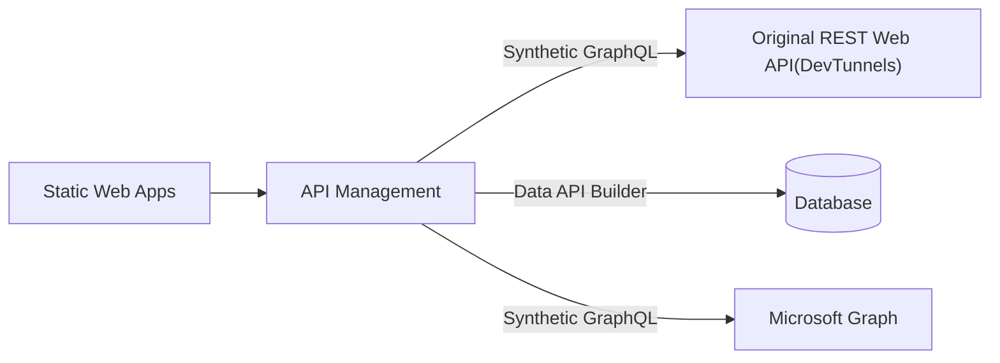

API ManagementとGraphQLを試して見るやつ。



# オリジナルなREST APIをGraph QLにする

* GraphQLのスキーマ情報にマッチするWebAPIを選択する方式でAPIM上の設定をおこなう
* [登録したGraph QLスキーマ](./Apim/employee.graphql)
* [接続先のWeb API](./LearnGraphQL.Api/Controllers)
  * Azure上にアップするのは面倒だったのでDevTunnelsを利用した


`Select File`で作成したGraph QLスキーマを読み込む。

作成後、GraohQLスキーマとREST APIのマッピングを行う


Resolversで紐づけを行う。Graph QLの中で使用された値は`context.GraphQL.Arguments["???"]`で利用する。


下記のようなXMLを記載した。

``` xml
<http-data-source>
	<http-request>
		<set-method>GET</set-method>
		<set-url>@($"https://{api-path}/api/Employee/{context.GraphQL.Arguments["id"]}")</set-url>
	</http-request>
</http-data-source>
```

実際に利用したXMLは [Resolvers.xml](./Apim/Resolvers.xml)を参照。

結果、Graph QLを介してWeb APIの結果を取得できるようになった。


## 参考

[graphql schema resolve api](https://learn.microsoft.com/ja-jp/azure/api-management/graphql-schema-resolve-api)

# Authorizationsを設定してAADの情報をGraph QLで取得する

## フェーズ１：認証設定を使えるようにする

1. AADで認証用のアプリケーションとシークレットを作成
2. APIMの認証設定
  * ドキュメントでAAD v1を利用しているのがちょっと。。。って感じなのでPKCEで作り直し
  * 
  * 現在(2023/6/18)アクセスポリシー設定画面からOKボタンが消失し編集できないので注意
3. ポリシーで認証設定からトークン情報をひっこぬいてヘッダ設定するよう変更
  * 設定したXMLは[ポリシーXML](./Apim/Policy.xml)を参照
4. 取得テスト
  * 


## フェーズ2：Graph QLで利用できるようにする

1. Graph QLスキーマの作成
  * 作成したスキーマは[user.graphql](./Apim/user.graphql)を参照
2. APIMで1で作成したスキーマを読み込み
3. Resolversの設定
  * フェーズ１でやったようにアクセストークンを取得しヘッダに付与する工程が必要
  * 作成したリゾルバは[Resolvers.xml](./Apim/Resolvers.xml)のmeの部分を参照
4. 検証利用可能になった
  * 

## 参考

* [Get Authorization Context Policy](https://learn.microsoft.com/ja-jp/azure/api-management/get-authorization-context-policy)
* [Create an authorization with the Microsoft Graph API](https://learn.microsoft.com/en-us/azure/api-management/authorizations-how-to-azure-ad)
* [HTTP data source for a resolver](https://learn.microsoft.com/en-us/azure/api-management/http-data-source-policy)