API ManagementとGraphQLを試して見るやつ。

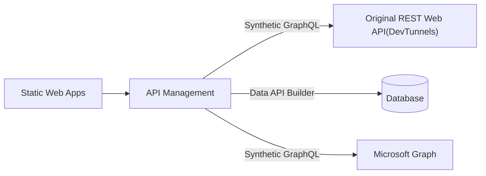

# オリジナルなREST APIをGraph QLにする

* GraphQLのスキーマ情報にマッチするWebAPIを選択する方式でAPIM上の設定をおこなう
* [登録したGraph QLスキーマ](./Apim/employee.graphql)
* [接続先のWeb API](./LearnGraphQL.Api/Controllers)
  * Azure上にアップするのは面倒だったのでDevTunnelsを利用した

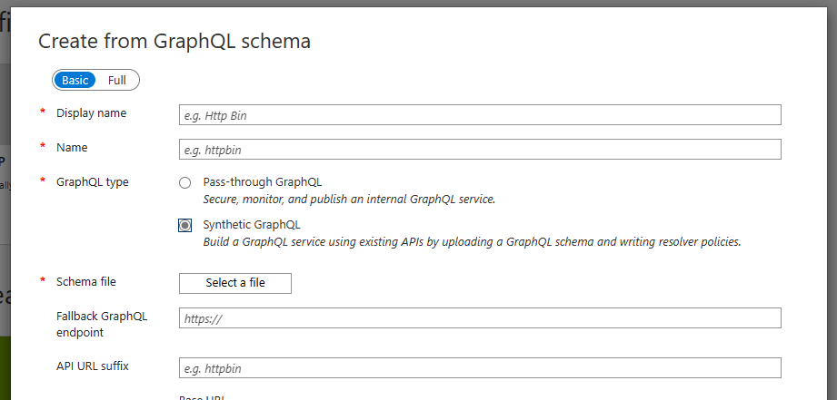

`Select File`で作成したGraph QLスキーマを読み込む。

作成後、GraohQLスキーマとREST APIのマッピングを行う

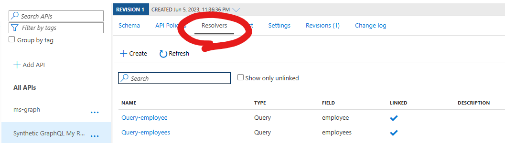

Resolversで紐づけを行う。Graph QLの中で使用された値は`context.GraphQL.Arguments["???"]`で利用する。

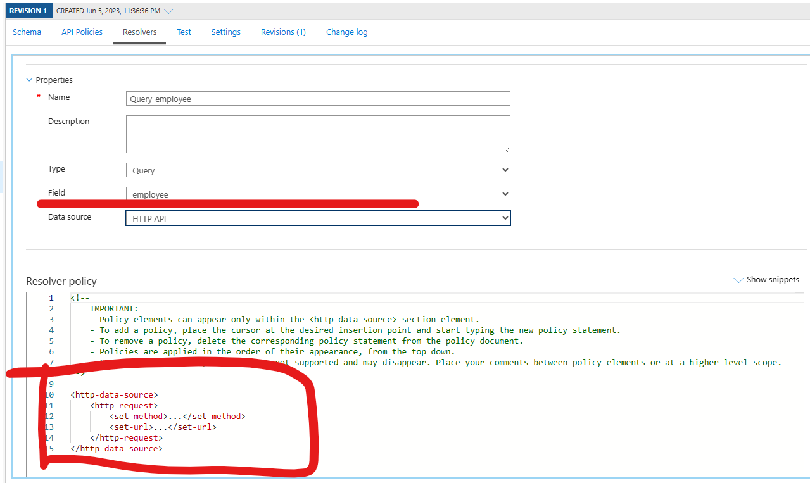

下記のようなXMLを記載した。

``` xml
<http-data-source>
	<http-request>
		<set-method>GET</set-method>
		<set-url>@($"https://{api-path}/api/Employee/{context.GraphQL.Arguments["id"]}")</set-url>
	</http-request>
</http-data-source>
```

実際に利用したXMLは [Resolvers.xml](./Apim/Resolvers.xml)を参照。

結果、Graph QLを介してWeb APIの結果を取得できるようになった。

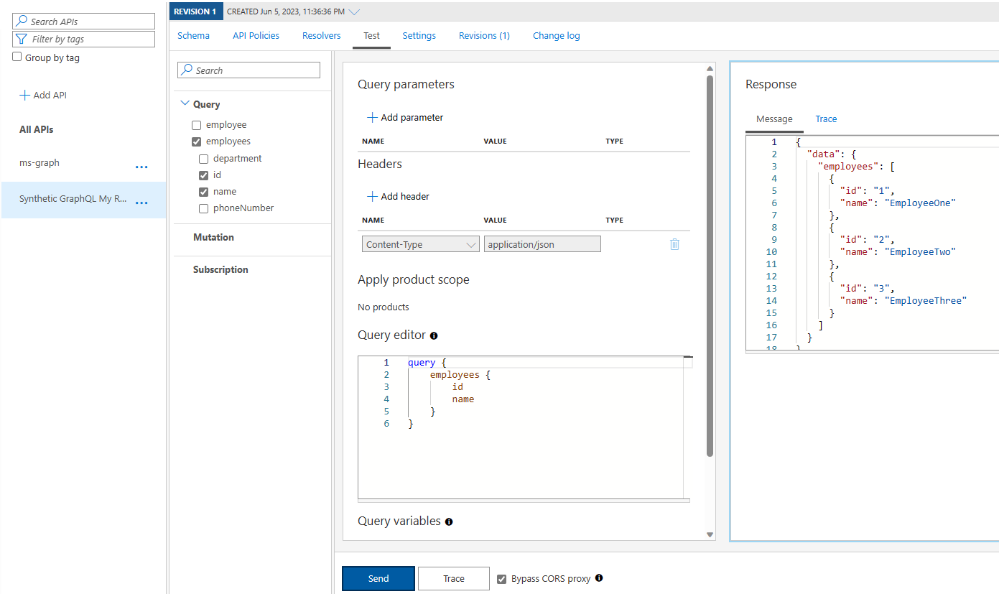

## 参考

[graphql schema resolve api](https://learn.microsoft.com/ja-jp/azure/api-management/graphql-schema-resolve-api)

# Authorizationsを設定してAADの情報をGraph QLで取得する

## フェーズ１：認証設定を使えるようにする

1. AADで認証用のアプリケーションとシークレットを作成
2. APIMの認証設定
  * ドキュメントでAAD v1を利用しているのがちょっと。。。って感じなのでPKCEで作り直し
  * 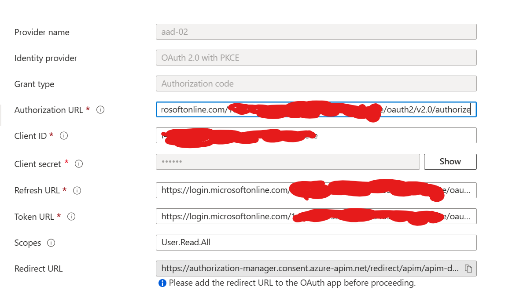
  * 現在(2023/6/18)アクセスポリシー設定画面からOKボタンが消失し編集できないので注意
3. ポリシーで認証設定からトークン情報をひっこぬいてヘッダ設定するよう変更
  * 設定したXMLは[ポリシーXML](./Apim/Policy.xml)を参照
4. 取得テスト
  * 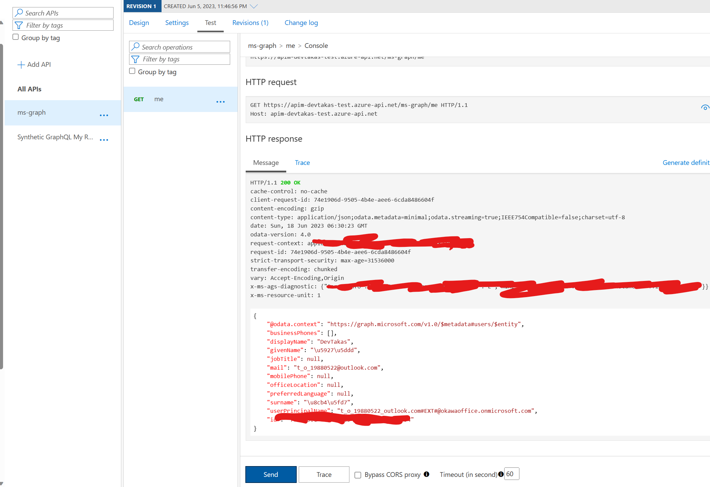


## フェーズ2：Graph QLで利用できるようにする

1. Graph QLスキーマの作成
  * 作成したスキーマは[user.graphql](./Apim/user.graphql)を参照
2. APIMで1で作成したスキーマを読み込み
3. Resolversの設定
  * フェーズ１でやったようにアクセストークンを取得しヘッダに付与する工程が必要
  * 作成したリゾルバは[Resolvers.xml](./Apim/Resolvers.xml)のmeの部分を参照
4. 検証利用可能になった
  * 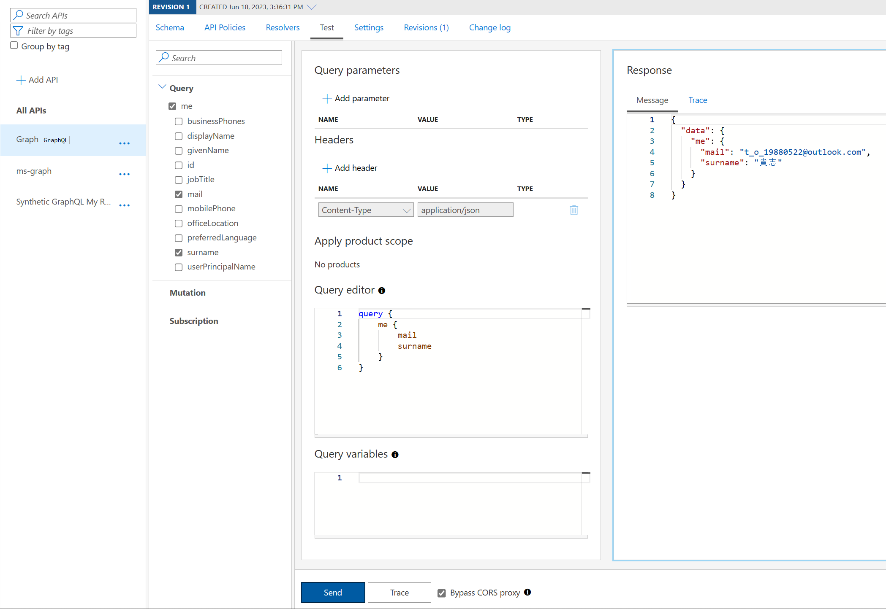

## 参考

* [Get Authorization Context Policy](https://learn.microsoft.com/ja-jp/azure/api-management/get-authorization-context-policy?wt.mc_id=M365-MVP-5003850)
* [Create an authorization with the Microsoft Graph API](https://learn.microsoft.com/en-us/azure/api-management/authorizations-how-to-azure-ad?wt.mc_id=M365-MVP-5003850)
* [HTTP data source for a resolver](https://learn.microsoft.com/en-us/azure/api-management/http-data-source-policy?wt.mc_id=M365-MVP-5003850)

# DatabaseにData Api Builderを介してAPIMからアクセスする

## はじめに

8/11段階でデータAPIビルダーはパブリックプレビュー状態。

記載のコマンドなどが変更される可能性がありますのでご注意ください。

## データAPIビルダーとは

データAPIビルダーを利用すると、RESTまたはGraph QLを介してデータベースにアクセスできるようになる。

接続できるデータベースは様々で、Azure SQL/SQL Sever/PostgreSQL/MySQL/Cosmos DBといった複数のDBに対応しているようである。

ローカルではコマンドベースで実行できる模様。

Azure上で利用する場合は、Static Web AppsやContainer Appsを利用して実行することができるようだ。

コンテナを利用する場合は[Microsoftが提供するコンテナ](https://mcr.microsoft.com/product/azure-databases/data-api-builder/about)に諸々設定を行うことで利用できるようになるよう。

## ローカルでの実行

### init

前述の通り、ローカルでの実行はコマンドベースで実行可能。

基本的に[クイックスタート](https://learn.microsoft.com/ja-jp/azure/data-api-builder/get-started/get-started-with-data-api-builder?wt.mc_id=M365-MVP-5003850)の通りに作業すれば利用できるようになる。

今回は[このリポジトリのDatabase](./LearnGraphQL.Database/)をローカルに構築したので下記のようなコマンドを実行する。

`dab init --database-type "mssql" --connection-string "Server=(localdb)\ProjectsV13;Database=LearnGraphQL.Database;Trusted_Connection=True;"`

作成された構成ファイルは [dab-config.json](./dab/dab-config.json)を参照。

## エンティティの追加

REST/Graphエンドポイントを作成する。ドキュメントにコマンドが記載されているのでそれのとおりに実行してみる。

今回作成したDBには`Item`テーブルがあるのでそれをターゲットにするため下記コマンドを実行する。

`dab add Item --source dbo.Item --permissions "anonymous:*"`

構成ファイル [dab-config.json](./dab/dab-config.json)が更新された。

更新された箇所は`entities`に記載されいる。

## データAPIビルダーを起動してアクセスする

`dab start`コマンドを実行するとWebAPIを介してアクセスできるようになる。

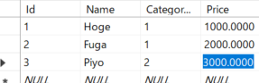

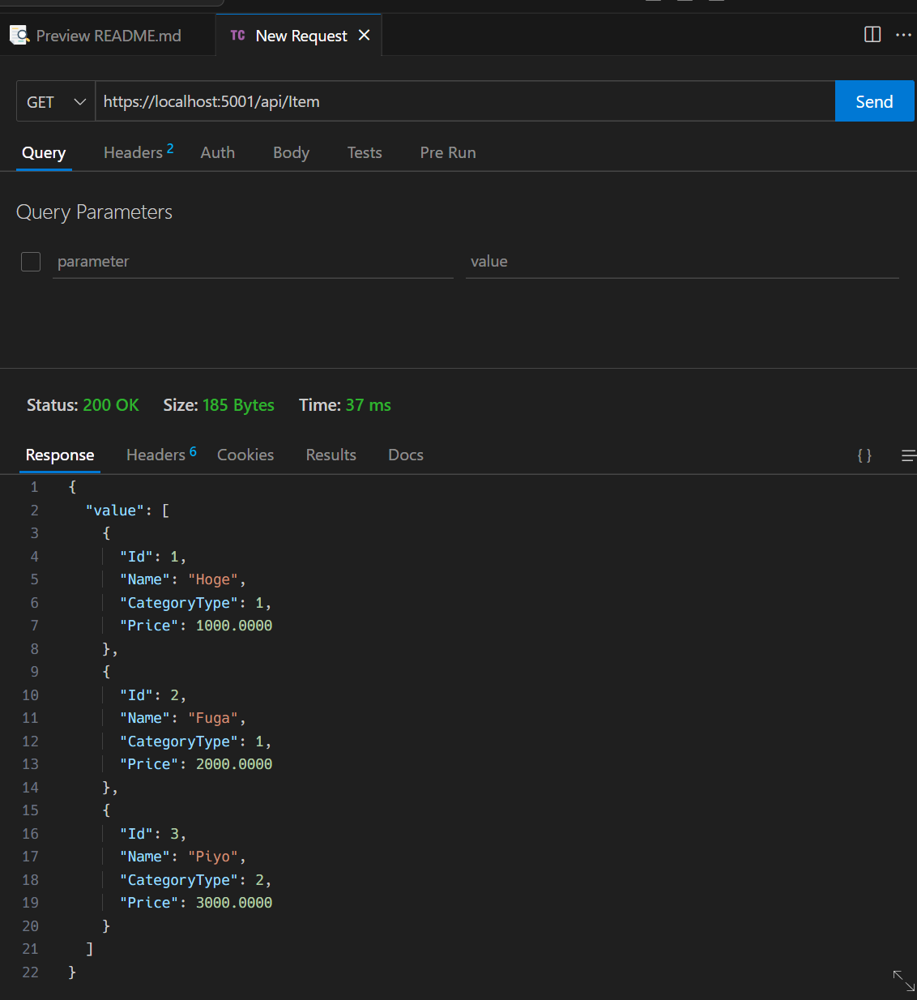

RESTの方はoData形式でアクセスできるようになっている模様。

GraphQLも同様にエンドポイントが作成されているので、下記のようにアクセスすることができる。

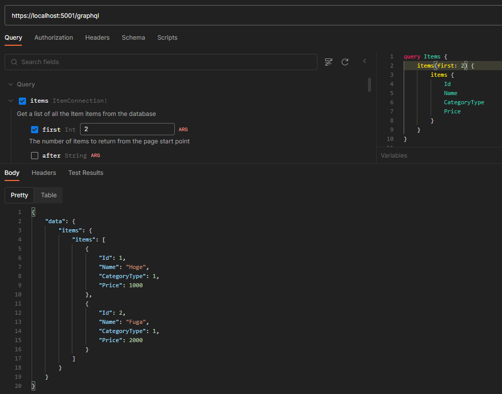

これをAPI ManagementからGraph QLでアクセスできるようにしたいので、スキーマを出力する。

`dab export --graphql -c dab-config.json -o ./schemas`

生成されたGraphQLスキーマは[schemasディレクトリ](./dab/schemas/)を参照。

APIMとの接続はAzureにあげるのは面倒なのでDev Tunnelを利用する。今回はCLIで下記コマンドを実行しホストする。

```cmd
devtunnel user login
devtunnel host -p 5001 --allow-anonymous --protocol https
```

環境をホストしたあとは下記のようにAPIMを設定する。`Schema file`には先程出力したGraph QLのスキーマファイルを指定する。

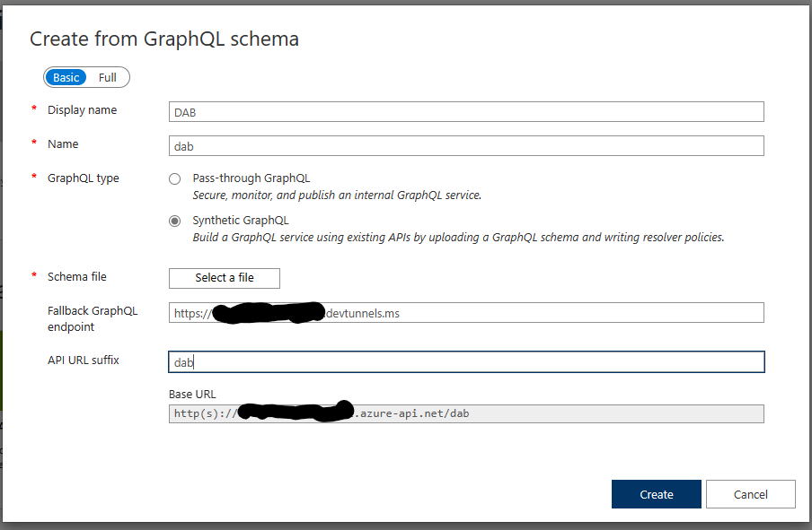

APIMでもDev Tunnelを介してData API Builderで作成したAPIにアクセスできるようになった。

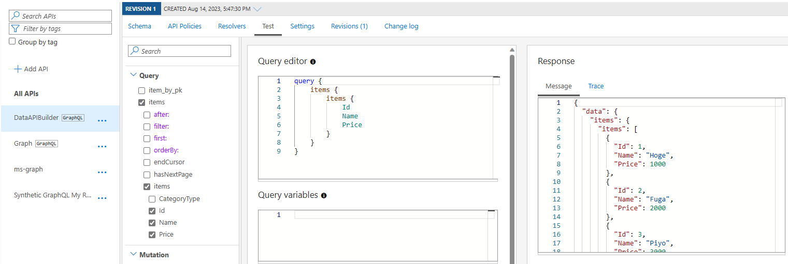

## 参考

* [データ API ビルダーとは](https://learn.microsoft.com/ja-jp/azure/data-api-builder/overview-to-data-api-builder?tabs=azure-sql?wt.mc_id=M365-MVP-5003850)
* [Azure での Data API ビルダーの実行](https://learn.microsoft.com/ja-jp/azure/data-api-builder/running-in-azure?wt.mc_id=M365-MVP-5003850)
* [dab CLI について](https://learn.microsoft.com/ja-jp/azure/data-api-builder/data-api-builder-cli?wt.mc_id=M365-MVP-5003850)
* [クイック スタート: Azure SQLで Data API ビルダーを使用する](https://learn.microsoft.com/ja-jp/azure/data-api-builder/get-started/get-started-azure-sql)
* [データ API ビルダーの REST](https://learn.microsoft.com/ja-jp/azure/data-api-builder/rest)
* [スキーマをエクスポートする新しい CLI コマンドGraphQL](https://learn.microsoft.com/ja-jp/azure/data-api-builder/whats-new-0-6-13#new-cli-command-to-export-graphql-schema)
* [Dev トンネルのコマンド ライン リファレンス](https://learn.microsoft.com/ja-jp/azure/developer/dev-tunnels/cli-commands)