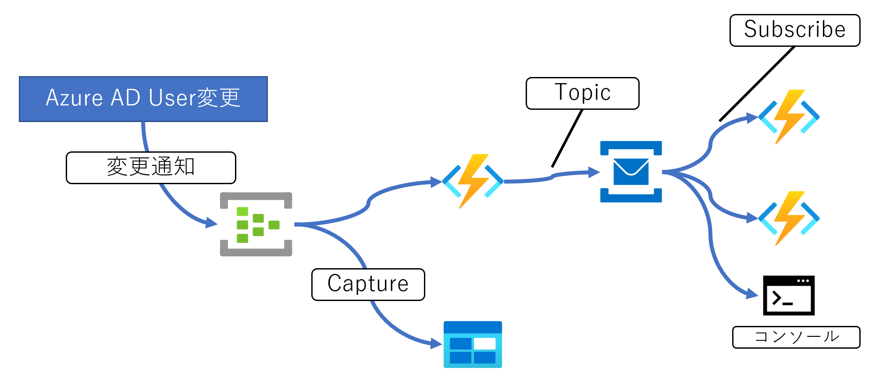

2020年10月 .NETラボ発表デモで使用

下記のような構成のFunctions/ConsoleAppで使用

## SampleFunctionOne

EventHubsの変更レシーバ

ServiceBusに変更を伝播する。

## SampleFunctionTwo

ServiceBusの変更レシーバ1。

## SampleFunctionThree

ServiceBusの変更レシーバ2。

## ConsoleApp1

ServiceBusの変更レシーバ3。
