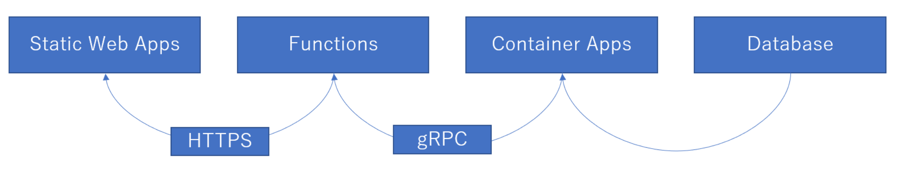

# Database Init

1. `cd /workspace/database/SwaAndCwa.Database`
2. `dotnet build`
3. `cp /workspace/database/SwaAndCwa.Database/bin/Debug/netstandard2.0/SwaAndCwa.Database.dacpac /workspace/resources/SwaAndCwa.Database.dacpac`
4. `/opt/sqlpackage/sqlpackage /Action:Publish /SourceFile:/workspace/resources/SwaAndCwa.Database.dacpac /TargetServerName:localhost /TargetDatabaseName:SwaAndCwa.Database /TargetUser:sa /TargetPassword:P@ssw0rd`
    * `/workspace/database/SwaAndCwa.Database/bin/Debug/netstandard2.0/SwaAndCwa.Database.dacpac`に発行したdacpac直接指定してもよし

# API

0. `dotnet dev-certs https --trust`